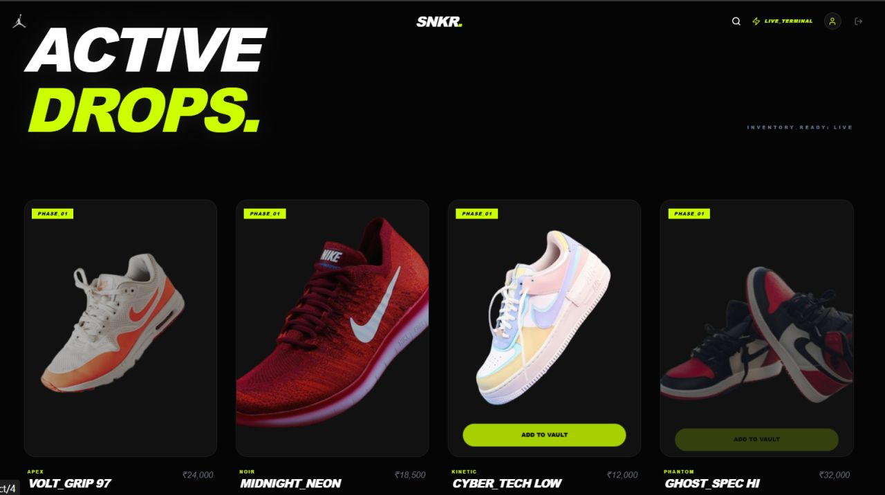
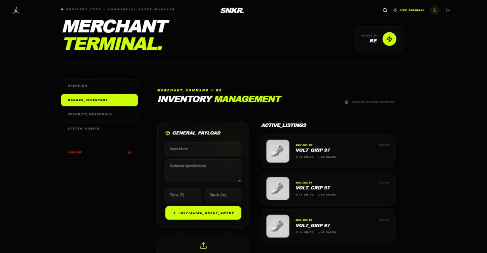

# 👟 Sneaker Hub – Shoes E-Commerce Platform

Sneaker Hub is a full-stack e-commerce web application built specifically for selling shoes.
It allows users to browse, search, and filter shoes based on brand, material, and color, providing a smooth and modern shopping experience.

## 🚀 Features
### 🛍️ User Features

- Browse a wide collection of shoes

- Search shoes by name

#### Filter shoes by:

- Brand

- Material

- Color

- View detailed product information

- Responsive UI for mobile and desktop

### ⚙️ Admin / Backend Features

- RESTful APIs for products and users

- MongoDB-based product storage

- Efficient filtering and search queries

- Secure and scalable backend architecture

## 🧑‍💻 Tech Stack
### Frontend

- Next.js

- Tailwind CSS 

- Axios for API calls

### Backend

- Node.js

- Express.js

- MongoDB

- Mongoose

## 📸 Screenshots

### 🏠 Homepage


### 👟 Product Page


### 🔍 Filter Feature


### 📂 Project Structure

```

shoes-ecommerce/
│
├── frontend/               # Next.js Frontend
│   ├── pages/
│   ├── components/
│   ├── styles/
│   ├── services/
│   └── public/
│
├── backend/                # Node.js + Express Backend
│   ├── models/
│   ├── routes/
│   ├── controllers/
│   ├── config/
│   └── server.js
│
├── README.md
└── package.json

```
#### 🔍 Shoe Filters Supported

- Brand (Nike, Adidas, Puma, etc.)

- Material (Leather, Mesh, Synthetic, etc.)

- Color (Black, White, Red, etc.)

- Price Range (optional enhancement)

### 🛠️ Installation & Setup

**1️⃣ Clone the Repository**
```
git clone https://github.com/your-username/shoes-ecommerce.git
cd shoes-ecommerce
```

**2️⃣ Backend Setup**
```
cd backend
npm install
npm run dev
```

**Create a .env file:**
```
MONGO_URI=your_mongodb_connection_string
PORT=5000
```
**3️⃣ Frontend Setup**

- cd frontend
- npm install
- npm run dev

#### 🌐 API Endpoints (Sample)

- GET    /api/shoes
- GET    /api/shoes?brand=Nike
- GET    /api/shoes?material=Leather
- GET    /api/shoes?color=Black
- POST   /api/shoes
- 

#### 🚧 Future Enhancements

- Cart and checkout system

- Payment gateway integration

- Admin dashboard

- Product reviews and ratings

- Wishlist feature

**🤝 Contributing**

- Contributions are welcome!
- Feel free to fork the repository and submit a pull request.

**📄 License**

This project is licensed under the MIT License.
